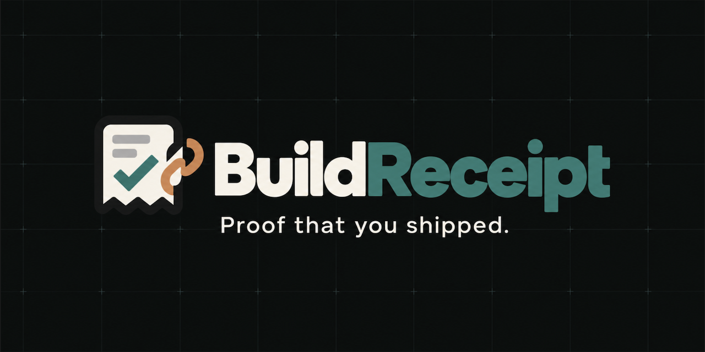

<p align="center">
  
</p>

<p align="center">
  An append-only, on-chain release receipt registry for software shipped on BOT Chain.
</p>

<p align="center">
  <a href="https://scan.botchain.ai/address/0x6c788cbc498795c0e3247d843431adbd844f73b9">Mainnet contract</a>
  ·
  <a href="https://scan.bohr.life/address/0x6c788cbc498795c0e3247d843431adbd844f73b9">Testnet contract</a>
  ·
  <a href="https://scan.botchain.ai/tx/0xa425b47d39fb507ef1345f77384c5056084c0d7a1d689c9722bb89e830c1da11">First mainnet receipt</a>
</p>

## What is BuildReceipt?

BuildReceipt turns a software release into a permanent record signed by its builder. Each receipt stores the project, version, release URL, commit hash, release note, builder wallet, block timestamp, and a deterministic content hash.

The registry is deliberately small and immutable:

- Receipt IDs begin at `1` and increase sequentially.
- The caller becomes the recorded builder.
- The chain supplies the receipt timestamp.
- Required fields cannot be empty and every field has a length limit.
- The content hash covers the builder and every release field.
- There are no update, delete, administrator, payment, withdrawal, token, NFT, or upgrade functions.

## BOT Chain mainnet deployment

| Item | Value |
| --- | --- |
| Network | BOT Chain Mainnet |
| Chain ID | `677` |
| Contract | [`0x6c788cbc498795c0e3247d843431adbd844f73b9`](https://scan.botchain.ai/address/0x6c788cbc498795c0e3247d843431adbd844f73b9) |
| Deployment transaction | [`0xbdcf…ac7cb2`](https://scan.botchain.ai/tx/0xbdcf94fbdfe1a3b26b95ea8b35218d9171d125db0cf07f7f8137d93c41ac7cb2) |
| Deployment block | [`24252534`](https://scan.botchain.ai/block/24252534) |
| First mainnet receipt | [`#1 · 0xa425…da11`](https://scan.botchain.ai/tx/0xa425b47d39fb507ef1345f77384c5056084c0d7a1d689c9722bb89e830c1da11) |
| First receipt content hash | `0x54c3ed585d8b8cebe01550531b1c10828efdd343909bc4017cf318890d32e51f` |
| Deployer | `0x6d80683ce6e499b7bC499a5716B824959b9BCFe9` |
| Solidity | `0.8.34+commit.80d5c536` |
| Source verification | [Fully verified on BOTScan](https://scan.botchain.ai/address/0x6c788cbc498795c0e3247d843431adbd844f73b9?tab=contract) |
| Deployment date | 23 September 2026 |

The deployment succeeded with an initial receipt count of `0`. A post-deployment RPC check confirmed that the runtime bytecode exactly matches the locally tested artifact, and BOTScan fully verified the submitted source and compiler settings. The guarded mainnet smoke test then created receipt `#1` and verified its stored fields, content hash, `ReceiptCreated` event, builder history, block timestamp, and post-transaction balance. The machine-readable deployment record is in [`deployments/bot-mainnet.json`](deployments/bot-mainnet.json).

The mainnet and testnet contracts have the same hexadecimal address because they were deployed by the same account at the same deployment nonce. They remain independent contracts on separate chains.

## BOT Chain testnet deployment

| Item | Value |
| --- | --- |
| Network | BOT Chain Testnet |
| Chain ID | `968` |
| Contract | [`0x6c788cbc498795c0e3247d843431adbd844f73b9`](https://scan.bohr.life/address/0x6c788cbc498795c0e3247d843431adbd844f73b9) |
| Deployment transaction | [`0x2fa5…11c09`](https://scan.bohr.life/tx/0x2fa5b077b42320b45fb2146a6823395ec9384a1fcefc263c2b5d68bafd911c09) |
| Deployment block | [`23979069`](https://scan.bohr.life/block/23979069) |
| First testnet receipt | [`0x0497…51e2c`](https://scan.bohr.life/tx/0x0497d952772dd1c64d1479d5560c35d17ef7a0cff70bcef7ccc6923dea051e2c) |
| Solidity | `0.8.34` |
| Deployment date | 20 September 2026 |

The machine-readable deployment record is in [`deployments/bot-testnet.json`](deployments/bot-testnet.json).

## Project structure

```text
contracts/        BuildReceipt contract and Solidity tests
test/             TypeScript integration tests
ignition/         Hardhat Ignition deployment module and deployment record
scripts/          Deployment and testnet verification scripts
deployments/      Safe public network metadata
web/              React and Vite frontend
```

## Local development

### Requirements

- Node.js 22 or newer
- npm
- MetaMask for browser testing

Clone the repository and install the contract dependencies:

```bash
git clone <repository-url>
cd buildreceipt
npm install
```

Compile and run all contract tests:

```bash
npx hardhat compile
npx hardhat test
```

Run the frontend locally:

```bash
cd web
npm install
npm run dev
```

The frontend connects to MetaMask, adds or switches to BOT Chain Testnet, creates receipts through the deployed contract, loads the connected wallet's history, and exposes public verification links such as `?receipt=1` without requiring a wallet connection.

Before publishing a frontend release, complete the [manual browser test checklist](docs/MANUAL_TESTING.md). The checklist includes wallet approval and rejection, an accidentally closed MetaMask sidebar, network switching, a real testnet receipt, history persistence, wallet separation, and BOTScan verification.

## BOT Chain Testnet

Add the network to MetaMask with these values:

| Setting | Value |
| --- | --- |
| Network name | BOT Chain Testnet |
| RPC URL | `https://rpc.bohr.life` |
| Chain ID | `968` |
| Currency symbol | `BOT` |
| Block explorer | `https://scan.bohr.life` |

Test BOT is available from the [official faucet](https://faucet.botchain.ai/en/basic).

## Deployment key safety

Use a dedicated deployment wallet. Never put its private key in the frontend, a committed environment file, screenshots, GitHub Actions logs, or source code.

Store the key in Hardhat's encrypted local keystore:

```bash
npx hardhat keystore set BOT_DEPLOYER_PRIVATE_KEY
```

The repository ignores `.env` files, but the encrypted Hardhat keystore is preferred for local deployment.

## Deploying

The Ignition module is available at `ignition/modules/BuildReceipt.ts`. BOT Chain currently requires a non-zero priority fee; the standalone deployment script includes the explicit EIP-1559 fee values used for the testnet deployment:

```bash
npx hardhat run scripts/deploy-build-receipt.ts
```

The mainnet deployment script performs chain, balance, gas, reserve, source-hash, bytecode, and initial-state checks. It also requires an explicit deployment guard:

```bash
CONFIRM_BOT_MAINNET_DEPLOY=YES npx hardhat run scripts/deploy-build-receipt-mainnet.ts
```

Validate the deployed mainnet registry with a protected two-step smoke test. The first command is read-only: it checks the chain, bytecode, empty initial state, receipt simulation, estimated fee, expected content hash, and preserved balance. The second command creates the first mainnet receipt and verifies the stored fields, event, history, timestamp, and final balance:

```bash
npx hardhat run --no-compile scripts/verify-build-receipt-mainnet.ts
CONFIRM_BOT_MAINNET_RECEIPT=YES npx hardhat run --no-compile scripts/verify-build-receipt-mainnet.ts
```

The write command is intentionally single-use. It refuses to run unless the registry still has a receipt count of `0`, preventing an accidental duplicate first receipt.

After deployment, update the public deployment metadata and verify the contract reads and write flow with a freshly configured script. The existing verification script points to the published testnet contract and creates a real receipt, so running it spends test BOT:

```bash
npx hardhat run scripts/verify-build-receipt-testnet.ts
```

## Contract interface

```solidity
function createReceipt(
    string calldata project,
    string calldata version,
    string calldata releaseUrl,
    string calldata commitHash,
    string calldata note
) external returns (uint256 receiptId);

function getReceiptIds(address builder)
    external
    view
    returns (uint256[] memory);
```

Public reads are also available through `receiptCount()` and `receipts(receiptId)`.

## Status

- [x] Immutable receipt contract
- [x] Contract test suite
- [x] BOT Chain testnet deployment
- [x] First on-chain testnet receipt
- [x] Responsive frontend shell
- [x] MetaMask and live Web3 integration
- [x] Manual browser transaction gate
- [x] Shareable receipt verification pages
- [x] BOT Chain mainnet deployment

## License

The smart contract declares SPDX license identifier `MIT`. A repository-level license file will be added before the first public release.
